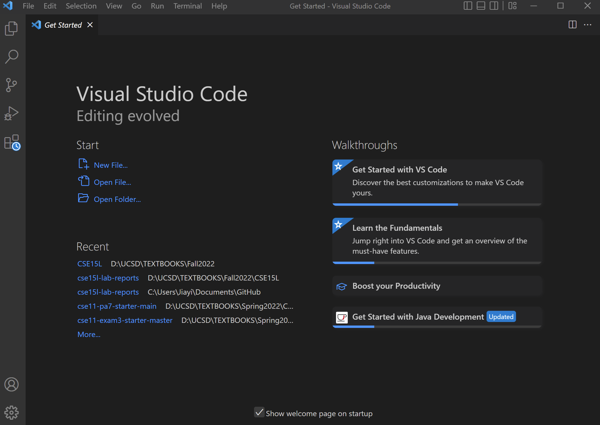
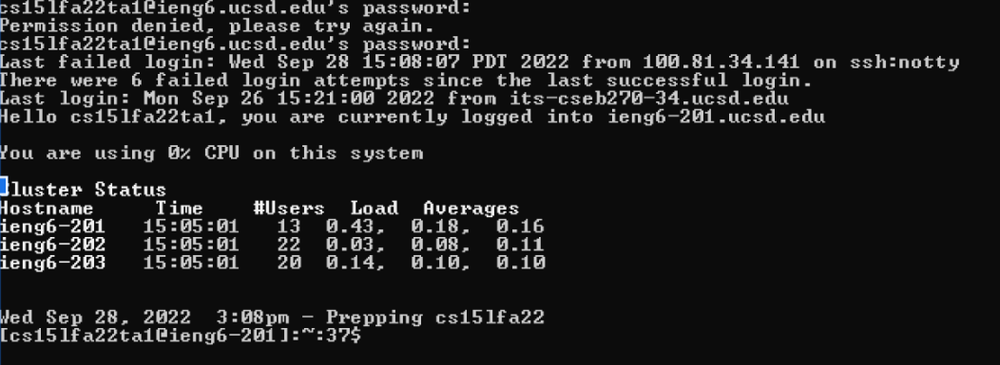
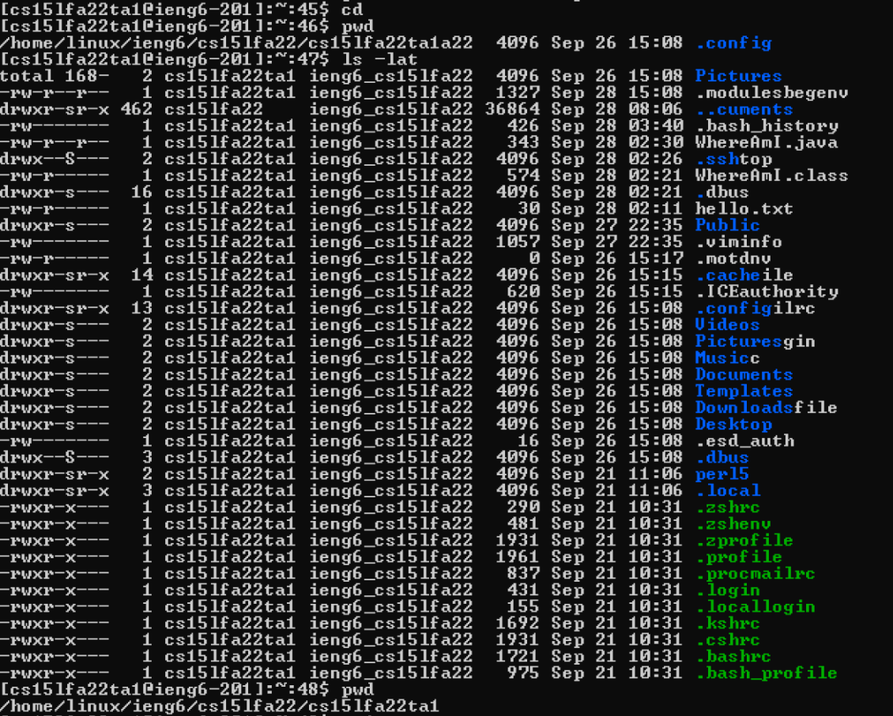
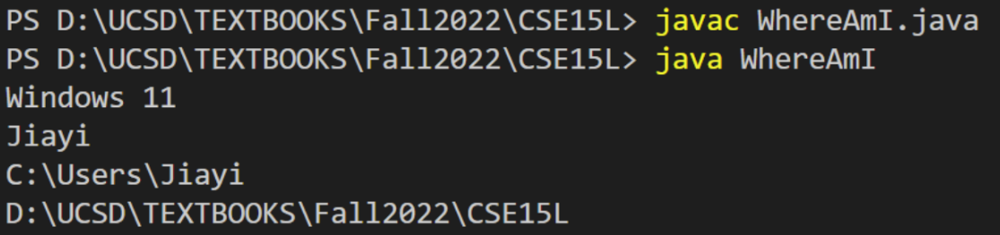
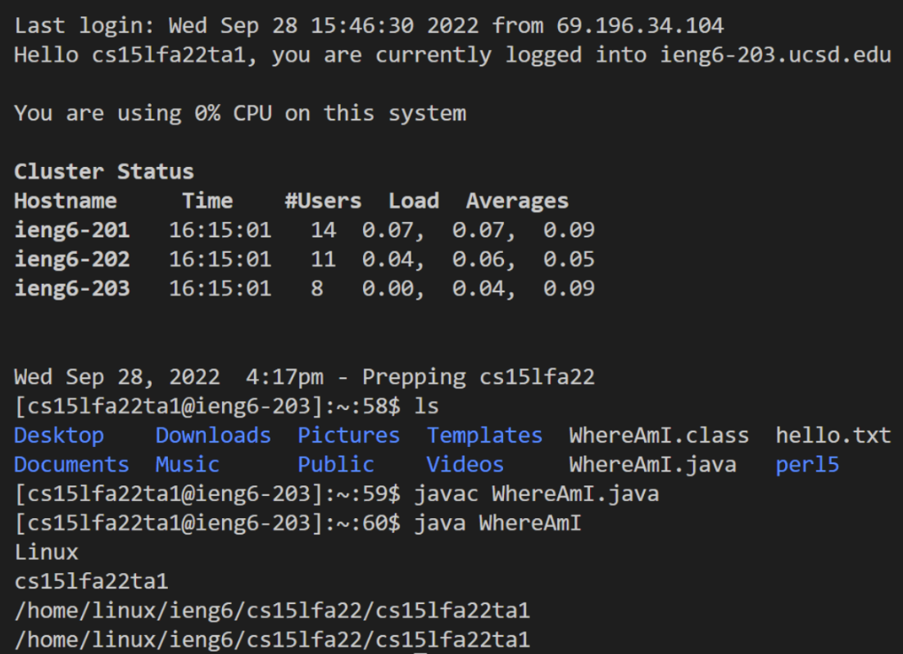

# Lab Report 1


## Installing VScode
Go to [VScode](https://code.visualstudio.com/) to install.
Run the program, you will see


## Remotely Connecting
Since I am on Windows, I followed the instruction from [Install OpenSSH](https://learn.microsoft.com/en-us/windows-server/administration/openssh/openssh_install_firstuse?tabs=gui)
I started by opening a terminal in VScode: click Terminal, then new Terminal.

Type in `$ ssh cs15lfa22ta1@ieng6.ucsd.edu`
Type "yes" and then enter the passward.
After that, you should see


## Trying Some Commands
I tried several commands
Useful commands to try are `cd`, `ls`, `pwd`, `mkdir`, and `cp`.


## Moving Files with scp
I opened a folder with VScode that stores all my CSE15L materials. I then created a java file named `WhereAmI`.

In this file, I copied 
```
class WhereAmI {
  public static void main(String[] args) {
    System.out.println(System.getProperty("os.name"));
    System.out.println(System.getProperty("user.name"));
    System.out.println(System.getProperty("user.home"));
    System.out.println(System.getProperty("user.dir"));
  }
}
```
into the java file.

Then, I compiled and ran the WhereAmI program using the javac and java commands:
```
javac WhereAmI.java
java WhereAmI
```
This is what I got:

OS here is Windows11.

I ran this command `scp WhereAmI.java cs15lfa22ta1@ieng6.ucsd.edu:~/`
in this terminal.
I entered passward as I just did to log into ssh.

Then, I logged into ieng6 with ssh again and compiled and ran the java file again.

This is what I got:

The OS is now Linux.

## Setting an SSH Key
Optimizing Remote Running