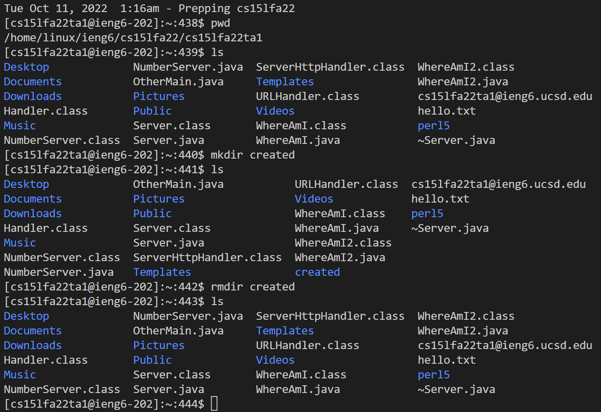
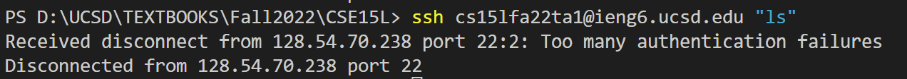

# Lab Report 1


## Installing VScode
Go to [VScode] (https://code.visualstudio.com/) to install.
Run the program, you will see

Since I have downloaded VScode before the lab, I skipped this part.

## Remotely Connecting
Since I am on Windows, I followed the instruction from [Install OpenSSH](https://learn.microsoft.com/en-us/windows-server/administration/openssh/openssh_install_firstuse?tabs=gui)
I started by opening a terminal in VScode: click Terminal, then new Terminal.

Type in `$ ssh cs15lfa22ta1@ieng6.ucsd.edu`
Type "yes" and then enter the passward.
After that, I see

This message means that login is successful.

## Trying Some Commands
I tried several commands.
Useful commands to try are `cd`, `ls`, `pwd`, `mkdir`, and `cp`.
Here, I tried pwd, which shows current working directory. Since I have successfully accessed the remote computor, it shows "Linux" instead of "Windows11"
I also tried `mkdir`, which makes a file. Here, I call this file "created". I can see it by using the command`ls`, which prints out all the files in current directory. Then, I removed it with `rmdir` + `created`, and it is gone when I do `ls` again. Now I see the file is gone, the removal was successful.


## Moving Files with scp
I opened a folder with VScode that stores all my CSE15L materials. I then created a java file named `WhereAmI` in my laptop folder.

In this file, I copied 
```
class WhereAmI {
  public static void main(String[] args) {
    System.out.println(System.getProperty("os.name"));
    System.out.println(System.getProperty("user.name"));
    System.out.println(System.getProperty("user.home"));
    System.out.println(System.getProperty("user.dir"));
  }
}
//This is provided by the Week1 lab task page.
```
into the java file.

Then, I compiled and ran the WhereAmI program using the javac and java commands, respectively:
```
javac WhereAmI.java
java WhereAmI
```
This is what I got:

OS here is Windows11.

I ran this command `scp WhereAmI.java cs15lfa22ta1@ieng6.ucsd.edu:~/`
in this terminal. So, the indicated file `WhereAmI` is copied from my local computer to the remote server `cs15lfa22ta1@ieng6.ucsd.edu`. Specifically, `~` here means "my home directory". Therefore this file is copied to the home directory on remote computer.
I entered passward as I just did to log into ssh.

Then, I logged into ieng6 with ssh again and compiled and ran the java file again.

This is what I got:

Since now I am accessing the file on remote computer, the OS is Linux instead of Windows11.

## Setting an SSH Key
I am using Windows. I successfully generated the keys with `ssh-keygen -t ed25519`
However, I could not see the output the instruction showed.
```
Mode                LastWriteTime         Length Name
----                -------------         ------ ----
-a----         6/3/2021   2:55 PM            464 ed25519
-a----         6/3/2021   2:55 PM            103 ed25519.pub
```
I think I might in the wrong directory because when I do `ls `, it shows
```
Directory: D:\UCSD\TEXTBOOKS\Fall2022\CSE15L


Mode                 LastWriteTime         Length Name
----                 -------------         ------ ----
d-----         9/29/2022  12:20 AM                cse15l-lab-reports
-a----         9/26/2022   2:23 PM        1124710 LE1.pdf
-a----         9/28/2022   3:51 PM            574 WhereAmI.class
-a----         9/28/2022   3:28 PM            311 WhereAmI.java
```
Therefore, I tried to change my working directory using `cd`. I changed to the default folder where the key is supposed to be. However, an error message reports that the file is not found.
Then, I tried to start the ssh-agent service, but it reports an error message.

I will figure this out in an office hour.

## Optimizing Remote Running
I did not manage to store and access the key, so when I tried to directly access some files or show directories on the remote computor, it reports an error when I did `ssh cs15lfa22@ieng6.ucsd.edu "ls"`

Then, I tried to clear the password files using `rm C:\Users\Jiayi\.ssh\id_ed25519.pub`, and `rm C:\Users\Jiayi\.ssh\id_ed25519.`.
Al last, I tried `ssh cs15lfa22@ieng6.ucsd.edu "ls"` again. As expected, it asks for passward.


