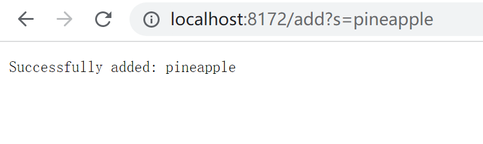
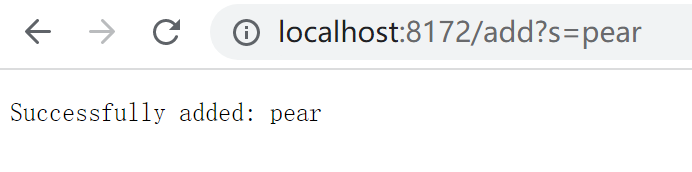

# Lab Report 2
---
## Part 1
Here is my code:
```
import java.io.IOException;
import java.net.URI;
import java.util.ArrayList;

class Handler1 implements URLHandler {
    ArrayList<String> strList = new ArrayList<String>();
    String str = "";

    public String handleRequest(URI url) {
        if (url.getPath().equals("/")) {
            return str;
        } 
        else if (url.getPath().contains("/add")) {
            String[] parameters = url.getQuery().split("=");
            
            if (parameters[0].equals("s")) {
                strList.add(parameters[1]);
                return "Successfully added: " + parameters[1];
            }
        }
        else if (url.getPath().equals("/search")){
            System.out.println("Path: " + url.getPath());
            if (url.getPath().contains("/search")) {
                String[] searchFor = url.getQuery().split("=");

                if (searchFor[0].equals("s")) {
                    ArrayList<String> toPrint = new ArrayList<String>();
                    for (String element : strList) {
                        if (element.contains(searchFor[1])) {
                            toPrint.add(element);
                        }
                    }
                    return String.format("" + toPrint);
                }
            }
        }
        return "404 Not Found!";
    }
}

class SearchEngine {
    public static void main(String[] args) throws IOException {
        if(args.length == 0){
            System.out.println("Missing port number! Try any number between 1024 to 49151");
            return;
        }

        int port = Integer.parseInt(args[0]);

        Server.start(port, new Handler1());
    }
}
```
On the command line, I first compiled my java files using `javac Server.java SearchEngine.java`, and ran the files with `java SearchEngine 8172`.
In this step, I called the `main` method named SearchEngine. Inside it, I created a new object `Handler1` that implements `handleRequest` written above. 
After running the java file, the Command line successfully generates a server because the method `Server.start(port, new Handler)` is called. The command line shows `Server Started! Visit http://localhost:2737 to visit.`
I clicked on the URL. The webpage looks like this:

Here, a method in class Handler1 that implements URLHandler is called. This method is named `handleRequest`. It takes in a url and returns a String. In this case, the getPath() method gets "/", so it returns an empty string `""`. That is why the webpage shows nothing.

Then, I tried to add `/add?s=pineapple` at the end of the URL. The `handleRequest` method recognizes the `add` inside the path, so the `.add(parameters[1])` method is called. Here, I used `.split` to make a list and get the element after `=` sign, which is `parameters[1]`, `"pineapple"`. As a result, pineapple is added to the string list, `strList`. The webpage returns `Successfully added: pineapple`.


I also tried to add pear and apple. The method calls are the same as above. String`"pear"` and `"apple"` are added to the list. Now the `strList` should have `{"pineapple", "pear", "apple"}`.



After that, I tried the search function. I added `/search?s=app` at the end of the domain. The command line behaves as follows:

The webpage shows:

as expected.
The method recognized `"/search"` in the URL path by calling `.contains`, so it checks the input after`=` and adds elements that contains the input in the original arraylist to a new arraylist. Then, the new arraylist gets printed out on the webpage.
In this case, in the array, `{"pineapple", "pear", "apple"}`, `"pineapple"` and `"apple"` contains the argument after `=`, `app`, so they are added to a new list named `toPrint` and are printed.

---
## Part 2
### Bug1
One bug I found is in the `filter` method in ListExamples file. Our group wrote a `class LengthChecker implements StringChecker`. It checks for length of the input string. If the length is greater than 5, return true; else, return false. In my test, I added 4 string elements to the list in total, in which two of them are longer than 5 characters. So, the expected output should be the two String elements in the same order as they are in the original list.
Here is my code:
```
public class ListTests{
    @Test 
	public void testFilter() {
        List<String> input1 = new ArrayList<>();
        input1.add("a");
        input1.add("banana");
        input1.add("123456");
        input1.add("c");
        
        List<String> expect1 = new ArrayList<>();
        expect1.add("banana");
        expect1.add("123456");

        LengthChecker sc = new LengthChecker();
        input1 = ListExamples.filter(input1, sc);

        assertEquals(expect1, input1);
    }
}
```
Here, `"banana"` should appear before `"123456"` when the `.flter` method is called. However, this test failed.

This is the sympton. The error message says that the order of the elements in the list is wrong.

I then look for bug/bugs that caused this problem. I found that in line 27, the checked String s is added to index 0 of the list, meaning that each time the string is prepended to the list, while it is supposed to be added at the end.

This is the bug.

After that, I fixed the bug by deleting the index at line 27.


Now I run the test, test passed.
```
PS D:\UCSD\TEXTBOOKS\Fall2022\CSE15L\lab3> java -cp ".;lib/junit-4.13.2.jar;lib/hamcrest-core-1.3.jar" org.junit.runner.JUnitCore ListTests
JUnit version 4.13.2
.
Time: 0.009

OK (1 test)
```

### Bug2
For ArrayExamples, there is a bug in `reversed` method. I ran tests as shown below
```
@Test
  public void testReversed() {
    int[] input1 = { };
    assertArrayEquals(new int[]{ }, ArrayExamples.reversed(input1));

    int[] input2 = {1, 2, 3};
    assertArrayEquals(new int[]{3, 2, 1}, ArrayExamples.reversed(input2));

    int[] input3 = {1, 2, 3, 4};
    assertArrayEquals(new int[]{4, 3, 2, 1}, ArrayExamples.reversed(input3));
  }
```

The error message indicates the sympton. It saya `arrays first differed at element [0]; expected:<3> but was:<0>` ... `at ArrayTests.testReversed(ArrayTests.java:24)`. So, I looked at line 24 in my test, which is 
```
int[] input2 = {1, 2, 3};
    assertArrayEquals(new int[]{3, 2, 1}, ArrayExamples.reversed(input2)); //line 24
```
This sympton is not as informative as the one seen in ListExamples file. 
I checked the original code, and found that the code is putting 0s into `arr`
```
  static int[] reversed(int[] arr) {
    int[] newArray = new int[arr.length];
    for(int i = 0; i < arr.length; i += 1) {
      arr[i] = newArray[arr.length - i - 1]; //wrong order, should be newArray[i] = arr[arr.length - i - 1];
    }
    return arr; //should return newArray;
  }
```
Since `newArray` is only initialized without putting any elements in it, it should store 0s in it. Here, we let `arr[y] = newArray[arr.length - i - 1];`, making each element in `arr` 0.
The code should change to 
```
static int[] reversed(int[] arr) {
    int[] newArray = new int[arr.length];
    for(int i = 0; i < arr.length; i += 1) {
      newArray[i] = arr[arr.length - i - 1]; 
    }
    return newArray; 
  }
```
Compile and run the test again, test passed.
```
PS D:\UCSD\TEXTBOOKS\Fall2022\CSE15L\lab3> java -cp ".;lib/junit-4.13.2.jar;lib/hamcrest-core-1.3.jar" org.junit.runner.JUnitCore ArrayTests
JUnit version 4.13.2
...
Time: 0.01

OK (3 tests)
```